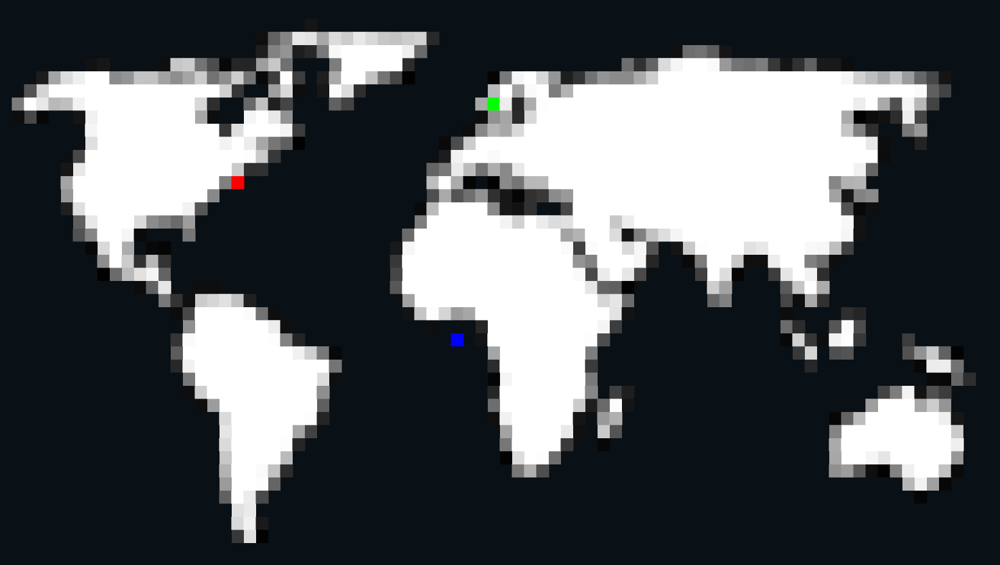

# PHP Cli Image

[](https://github.com/ixnode/php-cli-image/releases)
[](https://github.com/ixnode/php-cli-image/releases)

[](https://www.php.net/supported-versions.php)
[](https://phpstan.org/user-guide/rule-levels)
[](https://phpunit.de)
[](https://www.php-fig.org/psr/psr-12/)
[](https://github.com/phpmd/phpmd)
[](https://github.com/rectorphp/rector)
[](https://github.com/ixnode/php-api-version-bundle/blob/master/LICENSE)

> This library prints a given image to cli as ascii string.

## 1. Usage

```php
use Ixnode\PhpCliImage\CliImage;
```

### 1.1 Simple example

```php
$file = new File('path/to/image');
$width = 80;
$image = new CliImage($file);

print $image->getAsciiString($width);
```

## 2. Installation

```bash
composer require ixnode/php-cli-image
```

```bash
vendor/bin/php-cli-image -V
```

```bash
php-cli-image 0.1.0 (03-07-2023 01:17:26) - Björn Hempel <bjoern@hempel.li>
```

## 3. Command line tool

> Used to quickly check the image output of given image.

```bash
bin/console ci docs/image/world-map.png --engine=gd-image --width=80
```

or within your composer project:

```bash
vendor/bin/php-cli-image ci vendor/ixnode/php-cli-image/docs/image/world-map.png
```

```bash

                     ▄▄▄▄▀▄▄▄▄▄▄▄▄▄▄
       ▄▄    ▄▄▄▄▄▄▄▄▀▀▀▀▀▀▀▀▀▀▀▀▀▀                ▄▄▄▄▀▀▀▀▀▄▄▄▄▄▄▄▄▄▄
  ▄▀▀▀▀▀▀▀▀▀▀▀▀▀▀▀▀▀▀▀▀▀▀ ▀▀▀▀▀▀▀▀      ▀▀▀▀▀▀▀▀▀▀▀▀▀▀▀▀▀▀▀▀▀▀▀▀▀▀▀▀▀▀▀▀▀▀▀▀▀▀
 ▀▀▀▀▀▀▀▀▀▀▀▀▀▀▀▀▀  ▀▀▀▀   ▀▀          ▀▀▀▀▀▀▀▀▀▀▀▀▀▀▀▀▀▀▀▀▀▀▀▀▀▀▀▀▀▀▀▀▀▀▀▀▀▀
       ▀▀▀▀▀▀▀▀▀▀▀▀▀▀▀▀▀▀           ▄▄▀▀▀▀▀▀▀▀▀▀▀▀▀▀▀▀▀▀▀▀▀▀▀▀▀▀▀▀▀▀▀▀▀▀▄ ▀▀
     ▄▀▀▀▀▀▀▀▀▀▀▀▀▀▀▀▀▀            ▄▀▀▀▀▀▀▀▀▀▀▀▀▀▀▀▀▀▀▀▀▀▀▀▀▀▀▀▀▀▀▀▀▀▀▀▀▀
     ▀▀▀▀▀▀▀▀▀▀▀▀▀▀▀               ▀▀▀▀▄▀▀▀▀▀▀▀▀▀▀▀▀▀▀▀▀▀▀▀▀▀▀▀▀▀▀▀▀▀▀▀▄
     ▀▀▀▀▀▀▀▀▀▀▀▀                 ▀▀▀▀▀▀▀▀▀▀▄▄▀▀▀▀▀▀▀▀▀▀▀▀▀▀▀▀▀▀▀▀▀▀▀▀▀▀
      ▀▀▀▀▀▀▄▄ ▀                ▄▀▀▀▀▀▀▀▀▀▀▀▀▀▀▀▀▀▀▀▀▀▀▀▀▀▀▀▀▀▀▀▀▀▀▀▀▀▀
        ▀▀▀▀▀▀                  ▀▀▀▀▀▀▀▀▀▀▀▀▀▀▀▀▀▀▀▀▀▀  ▀▀▀▀▀▀▀▀▀▀▀▀▀
           ▀▀▀▄▄▀▀▄▄▄           ▀▀▀▀▀▀▀▀▀▀▀▀▀▀▀▀▀▀▀▀      ▀▀    ▀▀▀▀
              ▀▀▀▀▀▀▀▀▀▄         ▀▀▀▀▀▀▀▀▀▀▀▀▀▀▀▀▀▀▀            ▀▄  ▄▀▀
              ▀▀▀▀▀▀▀▀▀▀▀▄▄▄           ▀▀▀▀▀▀▀▀▀▀▀              ▀▀▀▀▀▀▀   ▀▄▄▄▄
              ▀▀▀▀▀▀▀▀▀▀▀▀▀▀            ▀▀▀▀▀▀▀▀▀                 ▀        ▀▀▀▀▄
               ▀▀▀▀▀▀▀▀▀▀▀▀             ▀▀▀▀▀▀▀▀▀▄▀▀                   ▄▀▀▀▀▀▀
                  ▀▀▀▀▀▀▀▀▀             ▀▀▀▀▀▀▀▀ ▀▀                 ▀▀▀▀▀▀▀▀▀▀▀
                  ▀▀▀▀▀▀▀                ▀▀▀▀▀▀  ▀                  ▀▀▀▀▀▀▀▀▀▀▀
                  ▀▀▀▀▀▀                  ▀▀▀                       ▀▀▀▀▀▀▀▀▀▀▀
                  ▀▀▀▀                                                     ▀
                   ▀▀▀
```



## 4. Library development

```bash
git clone git@github.com:ixnode/php-cli-image.git && cd php-cli-image
```

```bash
composer install
```

```bash
composer test
```

## 5. License

This library is licensed under the MIT License - see the [LICENSE](/LICENSE) file for details.
